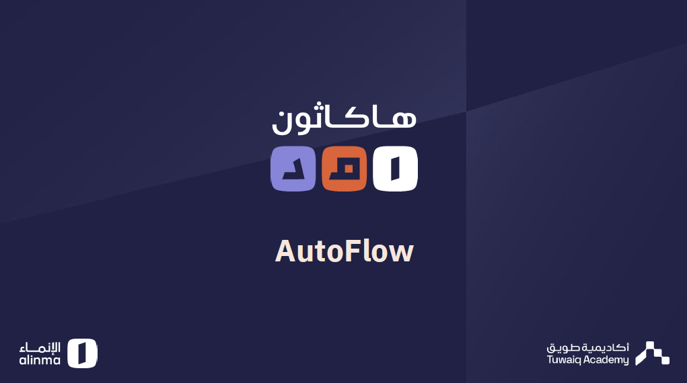

# AutoFlow



**Automate your financial routine — on your own terms.**

🔗 **Live demo:** [auto-flow-ecru.vercel.app](https://auto-flow-ecru.vercel.app/)
🎥 **Video walkthrough:** [How to use the prototype](https://www.youtube.com/shorts/ONA91pHLlJ0)

An interactive prototype of the Alinma Bank app featuring a new capability called **AutoFlow**: a financial automation hub that turns a plain-language idea into a clear, step-by-step automation you can review and adjust — without the assistant ever seeing your banking data, and without executing anything until you grant permission.

Built for **Hackathon Amd** (Alinma Bank × Tuwaiq Academy).

---

##  The Idea

Bank customers repeat the same financial actions every month: moving a percentage of their salary into savings, paying bills on time, making sure their balance never drops below a safe threshold... These tasks either get forgotten or require repeated manual effort.

**AutoFlow** solves this in three steps:

1. **Answer one simple question at a time** — when should it start, what should happen, is there a safety limit, and who approves it.
2. **Review a plain-language summary** — before saving, AutoFlow shows the whole automation as one clear sentence, e.g. "When your salary arrives, transfer 20% to your savings account, as long as your balance doesn't drop below 3,000 SAR, and it waits for your approval every time."
3. **Choose your trust level** — fully automatic execution, approval required every time, or conditional approval only above a certain amount.

---

##  Highlights

- **Guided automation wizard**: a focused 5-step flow (Trigger → Action → Safety → Approval → Review) — one decision per screen instead of a crowded editor.
- **Ready-made templates**: Salary Routine, Smart Bills, Balance Guard, and Month-End Surplus — start from a trusted template and tweak it.
- **Plain-language review**: every automation is summarized in one readable sentence before you save it, no jargon.
- **Full customization**: name and color per automation, instant activate/deactivate, and a running count of executions.
- **Privacy first**: explicit trust messaging throughout — "We never see your banking data, the assistant only designs the structure" — and nothing executes without the permission level you chose.
- **A complete bank app around the feature**: Home, Transfers, Payments, Store, and Services screens, with light/dark mode and a fully right-to-left Arabic interface.

---

##  Design References

The [`واجهات البنك`](./واجهات%20البنك) folder contains the light and dark mode interface designs this prototype was built from.

---

##  How the Automation Model Works

Every automation in AutoFlow is built from four parts, defined in [`src/main.jsx`](./src/main.jsx):

| Part | Purpose | Examples |
|---|---|---|
| Trigger | When the automation starts | Salary arrives, incoming transfer, scheduled date, bill due |
| Safety condition | Checked before execution | Minimum balance to keep after execution |
| Action | What happens | Transfer to savings, pay a bill, internal transfer, send a notification |
| Approval | Who decides execution | Automatic / requires my approval every time / conditional approval |

The wizard walks through these one at a time, then shows a single human-readable sentence combining all of them before the automation is saved.

---

##  Tech Stack

- **React 19** + **Vite 8** — UI and build tooling
- **lucide-react** — icons
- **Plain CSS** (no styling framework) — [`src/styles.css`](./src/styles.css)
- **pnpm** — package management

> Note: this is a front-end-only prototype, with no server or database — all state (theme, automations, etc.) lives locally in the browser.

---

##  Running Locally

```bash
# install dependencies
pnpm install

# start the dev server (also exposed on the local network)
pnpm dev

# build the production bundle
pnpm build

# preview the production build
pnpm preview
```

---

##  Project Structure

```
AutoFlow/
├── index.html            HTML entry point (RTL/Arabic)
├── src/
│   ├── main.jsx           Full app logic and UI (React)
│   └── styles.css         Styles
├── واجهات البنك/          Light/dark mode design references
└── vite.config.js
```

---

##  The Hackathon

**AutoFlow** — submitted for **Hackathon Amd**, a partnership between **Alinma Bank** and **Tuwaiq Academy**.
